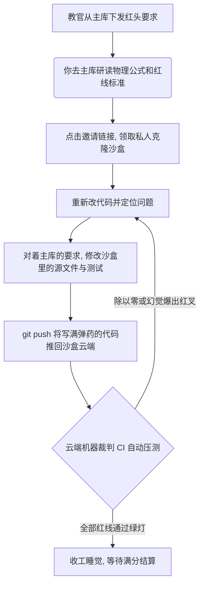

# 🌌 课程 GitHub 流水线拓扑全景图 (Ecosystem Topology)

本指南旨在为您（以及全班学生）理清这门课背后庞大而严密的“分布式防弹沙盒”系统架构。我们摒弃了传统的“交压缩包”模式，采用世界顶级的真实风投研发标准。

在一切混淆之前，请死死记住这条核心铁律：
**“理论与图纸在主库，代码与子弹在各自的沙盒。”**

---

## 🏛️ 1. 单源数据权威中心 (The SSOT Repository)
这是全班的“精神大本营”与知识下发广播塔。

- **仓库地址**：[`booblu/26Simu-Management-Modeling`](https://github.com/booblu/26Simu-Management-Modeling)
- **性质**：公开 (Public)
- **读写权限**：教官全局管理 (Admin) / 学生只能看甚至可以 Fork (Read-only)
- **存放什么**：
  - 课程大纲 `00_Syllabus_and_Docs/`（包含本拓扑图）
  - 全部上课课件 `01_Lectures/`
  - 实验与沙盘手册 `02_Labs_and_Workshops/`
  - **红头文件（作业要求）** `03_Assignments/`
  - 作弊小抄与资源 `04_Resources/`
- **严禁干什么**：学生**绝不**在此仓库下提交你的代码。主库里没有任何给你写代码的插槽！

---

## 🏗️ 2. 流水线母版铸造厂 (Starter Template Repositories)
这是教官独有的“模具厂”。每个作业在下发前，都会在这里浇筑好最极简的模型骨架和最严苛的门禁（CI），然后设定为 **Template（模板）**。

- **仓库地址（当前已部署）**：
  1. [`booblu/26Simu-Project1-Starter`](https://github.com/booblu/26Simu-Project1-Starter) (V3 引擎模板)
- **性质**：公开，但被特殊标记为 `Template Repository`
- **读写权限**：教官专有，不需要学生访问。
- **存放什么**：
  - 空白的 `src/` (用来装引擎模型)
  - 含有断言暗卡的 `tests/`
  - 云端裁判 `ci.yml` (自动阅卷批改脚本)
- **运作逻辑**：它就像一个印钞机的模子，永远不会被学生直接修改。它只负责在 GitHub Classroom 里被“无限印制”。

---

## 🏭 3. 自动化车间大群 (GitHub Classroom)
这是本门课程真正的“修罗场”与交付终端。

- **组织名称空间**：`simu-class-2026-brook` 
- **当前挂载的作战任务**：
  - `Task00 环境配置与工具链破冰`
  - `Project1-V3状态机模拟`
- **运作逻辑**：
  1. 每当发布一个新项目，教官会在班级群下发一条短链接（如 `https://classroom.github.com/a/...`）。
  2. 当班里的 60 位学生点击该链接后，Classroom 机器将会自动拉取第一层的**母版（Starter）**，并瞬间平行克隆出 60 个相互隔离的**私人保险箱仓库**。

---

## 📦 4. 你的专属量化沙盒 (Student Private Sandboxes)
当你在上面的步骤认领了作业后，恭喜你，你成为了自己沙盒的 CTO。

- **仓库地址**：`simu-class-2026-brook/[项目名]-[你的名字]` 
  *(例如：`simu-class-2026-brook/project1-v3-bob`)*
- **性质**：绝对私有 (Private)
- **读写权限**：只有[你] + [教官裁判] 能看能改能写。保证同桌之间绝对的保密。
- **你的任务流程图**：

---

**最终结语：**
如果你不知道该做什么作业，看主库。
如果你不知道在哪写代码，进你自己的私人沙盒库。
这就是你们面对未来系统工程的最高效法则。
